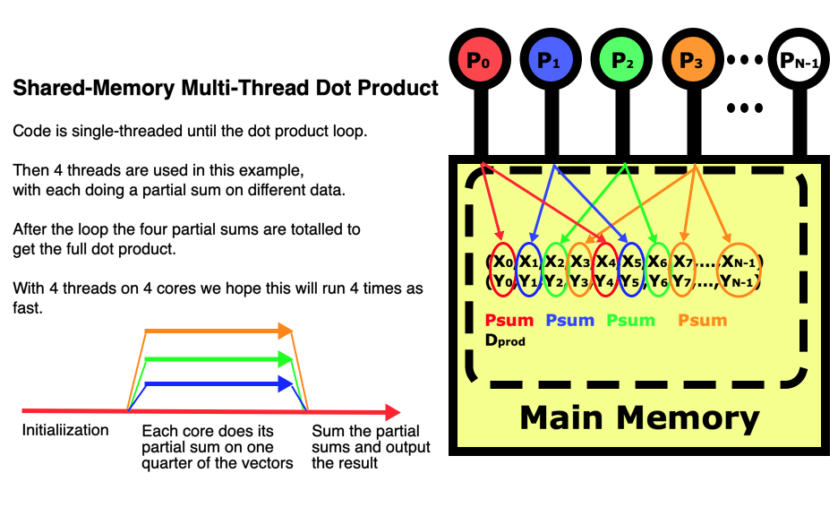

:::::::::::::::::::::::::::::::::::::: questions

- What is the multi-threaded shared-memory programming model?

::::::::::::::::::::::::::::::::::::::::::::::::

::::::::::::::::::::::::::::::::::::: objectives

- Learn about multi-threaded computing and how to use it.
- Understand the strengths and limitations of this approach.

::::::::::::::::::::::::::::::::::::::::::::::::


Most computer languages have the ability to do multi-threaded computing.
C/C++ and Fortran use the OpenMP package which is by far the most 
extensive and well developed.
It uses pragma statements to control the parallelization of loops so 
that multiple compute cores work at the same time on different parts
of the data.
OpenMP is not only extremely efficient, but it also provides very advanced
features offering greater control on how the parallelization is to be done,
all without encumbering the programmer too much.
The **pymp** package for Python is a stripped down version of OpenMP supporting
just the basic functionality.  It is an actively developed project
and is very efficient and relatively easy to use as well.
R takes a very different approach in doing multi-threading using the
**mclapply()** function which is a multi-core replacement for the 
**lapply()** function.
This operates similarly to OpenMP and pymp but uses a very different syntax.
It is also not nearly as efficient and requires some non-default choices to
make it more perform better.
Matlab also uses a different syntax in its Parallel Computing Toolbox
where it uses a **parfor** command to do a parallel **for** loop.

All of these methods behave basically the same by forking, or splitting off,
extra compute threads when called.
Each thread gets its own virtual memory space, meaning most large arrays are
not copied during the initialization stage.
If any thread writes to an array, only then is that array copied to that
thread's memory, and only the page of memory (4096 Bytes) that has been changed.
This is called a **copy-on-write** method and is handled by the operating
system.
Forking is very efficient in this way, only doing the work it needs.
For Python, this gets around the Global Interface Lock which is designed
to protect python objects.
Unfortunately the Windows operating system itself does not have support for 
the **fork** function
so you cannot run multi-threaded Python codes like **pymp** on Windows,
at least from the Power Shell.
However, if you have the Windows Subsystem for Linux (WSL) installed this
provides a robust Linux system that bypasses Windows and its limitations
so **pymp** codes can be run in this manner.

The figure below illustrates how multi-threading works on a
dot product between two vectors.  Since the program uses shared-memory,
the initialization is done entirely on the main thread of processor 1.
Then each of 4 threads in this example does a partial sum on the
vector elements it is responsible for, so all 4 threads are running
at the same time but operating on different parts of the data.
After they have all completed their parts of the computation, the master thread
sums all the partial sums into the dot product and prints it out.

{alt="Shared-memory multi-threaded dot product showing the memory layout of both vectors"}

### The multi-threaded dot product code

:::::::::::::::: group-tab

### Python

Let's go through the multi-threaded version of the dot product code
below to illustrate the changes that had to be made to the code to parallelize it.
The **pymp** package needs to be installed into
our virtual environment by doing **pip install pymp-pypi**.
Once that is installed, the **import pymp** line will bring those functions
into the code.

When we run the code we will want to set the number of threads for it to use.
In the code below, this is being set internally using the number of threads
passed in as a command line argument.
This is used to set the number of threads using the **pymp.config.num_threads**
variable.
The other method of setting the number of threads is to use the environmental
variable **PYMP_NUM_THREADS** externally.  For example, in your job script
you can have a line **export PYMP_NUM_THREADS=4** to tell the program to use
4 threads.

Right before the loop we must define our parallel environment with the
line **with pymp.Parallel( nthreads ) as p:** which
spins up the threads with the fork method.
Then the for loop range is changed so that each thread has a different range
for the elements of the loop that each thread is responsible for.

In the OpenMP multi-threading package used with C/C++ and Fortran, you
can use the same variable d_prod in the loop and just declare it as a 
variable to be used locally within each thread then globally summed at
the end, which is called a **reduction**.
This is very convenient and requires fewer changes to the code, but the
**pymp** package does not support this added function by choice opting for
the Python way of doing it more explicitly, so in our code we need
to create a shared array of partial sums and manually sum them together
at the end.  This is just as efficient computationally, it just takes a
little extra coding but is more explicit.

```python
# Do the dot product between two vectors X and Y then print the result
# USAGE:  python dot_product_threaded.py 4       to run on 4 threads

import sys
import time
import pymp

   # Get and set nthreads from the command line

pymp.config.num_threads = int( sys.argv[1] )
nthreads = pymp.config.num_threads

N = 100000000      # Do a large enough test to reduce timing variance

x = [ float( i ) for i in range( N ) ]
y = [ float( i ) for i in range( N ) ]

   # Now initialize a very large dummy array to force X and Y out of all levels of cache
   #    so that our times are for pulling elements up from main memory.

dummy = [ 0.0 for i in range( 125000000 ) ]  # Initialize 1 GB of memory

   # Now we start our timer and do our calculation using multiple threads

t_start = time.perf_counter()

psum = pymp.shared.array( (nthreads,), dtype='float' )
for i in range( nthreads ):
   psum[i] = 0.0

d_prod = 0.0
with pymp.Parallel( nthreads ) as p:
   for i in p.range( N ):
      #d_prod += x[i] * y[i]
      psum[p.thread_num] += x[i] * y[i]

for i in range( nthreads ):     # Explicitly do the reduction across threads
   d_prod += psum[i]

t_elapsed = time.perf_counter() - t_start

   # The calculation is done and timer stopped so print out the answer

print('dot product = ', d_prod, 'took ', t_elapsed, ' seconds' );
print( 2.0*N*1.0e-9 / t_elapsed, ' Gflops (billion floating-point operations per second)')
print( 2.0*N*8.0/1.0e9, ' GB memory used' )
```

### R

Not implemented yet.

### C

Let's go through the multi-threaded version of the dot product code
below to illustrate the changes that had to be made to the code to parallelize it.
In C/C++ we need a line **#include <omp.h>** to bring the OpenMP
headers, then the code needs to be compiled with the 
**-fopenmp** flag for **gcc** or the **-qopenmp** flag for **icc**.

When we run the code we will want to set the number of threads for it to use.
In the code below, this is being set internally using the number of threads
passed in as a command line argument.
This is used to set the number of threads using 
the **omp_set_num_threads()** function in C/C++.
The other method of setting the number of threads is to use the environmental
variable **OMP_NUM_THREADS** for C/C++/Fortran.  For example, in your job script
you can have a line **export OMP_NUM_THREADS=4** to tell the program to use
4 threads.

Right before the loop we must tell the compiler to parallelize the loop
using a **#pragma omp parallel for** statement, plus we need to indicate
that there is a reduction of **dprod** taking place at the end where
the partial sums calculated by each thread get globally summed at the end.
Then the for loop range is changed so that each thread has a different range
for the elements of the loop that each thread is responsible for.

```c
// Dot product in C using OpenMP
// USAGE:  dot_product_openmp 4   to run with 4 cores

#include <stdio.h>
#include <stdlib.h>
#include <time.h>
#include <sys/time.h>
#include <omp.h>

void main (int argc, char **argv)
{
   int i, N;
   double dprod, *X, *Y;
   double t_elapsed;
   struct timespec ts, tf;

      // Get the number of threads from the command line

   char *a = argv[1];
   int nthreads = atoi( a );

   N = 100000000;

      // Allocate space for the X and Y vectors

   X = malloc( N * sizeof(double) );
   Y = malloc( N * sizeof(double) );

      // Initialize the X and Y vectors

   for( i = 0; i < N; i++ ) {
      X[i] = (double) i;
      Y[i] = (double) i;
   }

      // Allocate and innitialize a dummy array to clear cache

   double *dummy = malloc( 125000000 * sizeof(double) );
   for( i = 0; i < 125000000; i++ ) { dummy[i] = 0.0; }


      // Now we start the timer and do our calculation

   clock_gettime(CLOCK_REALTIME, &ts);

   omp_set_num_threads( nthreads );

   dprod = 0.0;
#pragma omp parallel for reduction( +:dprod)
   for( i = 0; i < N; i++ ) {
      dprod += X[i] * Y[i];
   }

   clock_gettime(CLOCK_REALTIME, &tf);
   t_elapsed =  (double) ( tf.tv_sec - ts.tv_sec );
   t_elapsed += (double) (tf.tv_nsec - ts.tv_nsec) * 1e-9;

   printf("dot product = %e on %d threads took %lf seconds\n", dprod, nthreads, t_elapsed );
   printf("%lf Gflops (billion floating-point operations per second)\n",
          2.0*N*1.0e-9 / t_elapsed);
   printf( "%lf GB memory used\n", 2.0*N*8.0/1.0e9);
}
```

### Fortran

Not implemented yet.

### Matlab

Not implemented yet.

::::::::::::::::::::::::::

So parallelizing this program really only requires us to change around 11 lines
of code, and from that we get the benefit of being able to apply much greater
computing power.
We do have some control over how the parallelization works internally.
Using **p.range(N)** in our for loop will use static scheduling
where each thread is responsible for a pre-determined set of indices
at regular intervals as in the figure above.
If instead we use **p.xrange(N)** then dynamic scheduling will be used
where each index will be assigned to the next available thread.
This can be very useful if the amount of work in each pass through the loop
varies greatly.
Dynamic scheduling can produce much more efficient results in cases where there
is a great load imbalance.

### Understanding what can cause inefficient scaling

A scaling study is designed to expose inefficiencies in a parallel code 
and to determine how many cores to use for a given problem size.
That last part is important to understand.
If there is too little work in each iteration of a loop, then loop overhead
can limit scaling.
Calculations on larger data  sets usually scale better.

A loop may be very scalable in itself, but if there is too much time spent
in the scalar part of the code like initialization, doing the reductions,
or doing input at the beginning and output at the end, then the entire code
may not scale well.
Load imbalance can also be a problem.
If the time it takes to pass through a loop varies, then using dynamic scheduling
is very important.

Shared arrays are an extremely important part of multi-threaded packages.
Since they do involve the copy-on-write mechanism, they can lead to 
inefficiency in the loop.
In general this is minimal but something to be aware of.

Multi-threading packages like **OpenMP** and **pymp** provide mechanisms
that force loops in the algorithm out of multi-threaded operation and back into 
single-threaded operation.
This always leads to terrible scaling and should almost never be used.

:::::::::::::::::::::::::::::::::::::: challenge

## Scaling Study of the Multi-Threaded Dot Product Code

:::::::::::::::: group-tab

### Python

Measure the execution time for the dot_product_threaded.py code
for 1, 4, 8, and 16 cores.  If possible, use a job script
requesting 16 cores and do all runs in the same job.
You can look at the job scripts like sb.ddot_py in the **code**
directory as an example but your job script will probably be
different.
Then calculate the speedup compared to the scalar (single-core)
run to see how close to ideal the performance is.

If you want, you may also run a scaling study for the **matmult.py**
code.

### R

Not implemented yet.

### C

Not implemented yet.

### Fortran

Not implemented yet.

### Matlab

Not implemented yet.

::::::::::::::::::::::::::


:::::::::::::::::: solution

:::::::::::::::: group-tab

### Python

For this very simple problem, each thread can do its computations
totally independently.  There is only a global sum of all the
partial sums at the end, so we would expect the scaling to be
close to ideal.
In my measurements, I saw a 3.1x speedup on 4 cores, a 5.3x
speedup on 8 cores, and a 7.8x speedup on 16 cores.
For this problem, there just are so few computations being done
in each loop iteration, only 2 floating-point operations, that the
loop overhead is preventing better scaling.
A C/C++ version of this code using OpenMP for multi-threading runs
170 times faster because it is a compiled language,
but likewise does not scale well due to the
few computations being done in each pass through the loop.

### R

Not implemented yet.

### C

Not implemented yet.

### Fortran

Not implemented yet.

### Matlab

Not implemented yet.

::::::::::::::::::::::::::

:::::::::::::::::::::::::::

::::::::::::::::::::::::::::::::::::::::::::::::


::::::::::::::::::::::::::::::::::::: keypoints
- Multi-threaded computing is powerful and fairly easy to use but only works on one compute node.
- Understand key factors that can limit the efficient scaling of multi-threaded programs.
::::::::::::::::::::::::::::::::::::::::::::::::

### Links for additional information

* [github pymp](https://github.com/classner/pymp)
* [LLNL OpenMP tutorial](https://hpc-tutorials.llnl.gov/openmp/)

