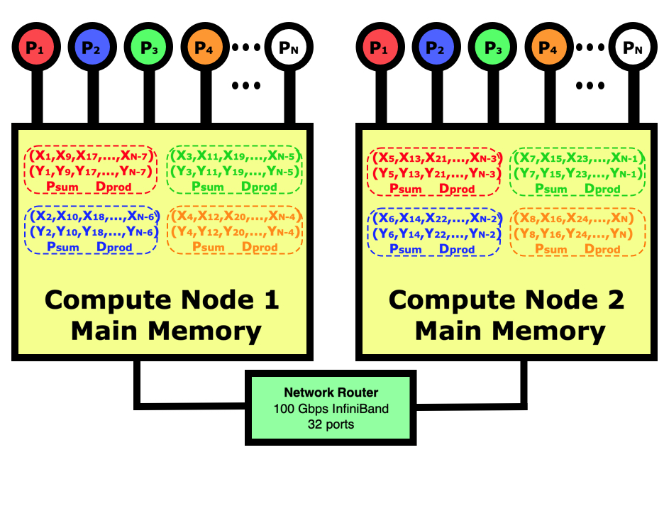

:::::::::::::::::::::::::::::::::::::: questions

- What is the distributed-memory programming model?

::::::::::::::::::::::::::::::::::::::::::::::::

::::::::::::::::::::::::::::::::::::: objectives

- Learn about message-passing in distributed-memory computing.
- Understand the strengths and limitations of this approach.

::::::::::::::::::::::::::::::::::::::::::::::::


## The Message-Passing Paradigm

While multi-threaded parallelization is very efficient when running
on a single compute node, at times we need to apply even more compute
power to a single job.
Since this will involve more than one compute node, we will need a separate
but identical program running on each computer which leads us to a new
programming paradigm.
This is known by various descriptive names including MPMD or Multiple Program
Multiple Data, but is more commonly known as message-passing which is how
data is exchanged between multiple identical copies of a program that each
operate on different data.
There is a common syntax used which is **MPI** or the **Message-Passing Initiative**
standard.
C/C++ and Fortran have several MPI implementations including 
free **OpenMPI** and **MPICH** libraries and commercial **Intel MPI**, 
while Python uses **mpi4py** which implements a stripped
down version of the MPI standard.
R does not have any message-passing implementation though there was work on **Rmpi** in
the past that was never completed.

The diagram below shows what a distributed-memory dot product looks like
on a multi-node computer in contrast to the shared-memory program
in the diagram in the previous chapter.
In this case, our job is running on 4 cores on node 1 and 4 cores on
node 2.
Distributed-memory means that there will be 8 identical programs running,
with 4 on each node, but each will have responsibility for doing one
eighth of the calculations.
We will need to use the **mpirun** or **mpiexec** commands to launch eight copies
of the program on the two nodes then start them running.
The jobs will handshake then decide which part of the data each is
responsible for.
After all nodes have calculated their partial sums, they will be
globally summed across all 8 tasks using the network if needed
then the program with lowest rank will print out the results.

:::::::::::::::: group-tab

### Python

{alt="Distributed-memory dot product showing the layout of both vectors on both computers"}

### R

{alt="Distributed-memory dot product showing the layout of both vectors on both computers"}

### C

{alt="Distributed-memory dot product showing the layout of both vectors on both computers"}

### Fortran

{alt="Distributed-memory dot product showing the layout of both vectors on both computers"}

### Matlab

{alt="Distributed-memory dot product showing the layout of both vectors on both computers"}

::::::::::::::::::::::::::

In parallel computing, the programmer must decide how to divide the data
between the processes.
In this case, we could have just as easily decided that rank 0 is responsible
for the first 1/8<sup>th</sup> of the elements, rank 1 for the
next 1/8<sup>th</sup>, etc.
If we were reading in the data and distributing it in blocks to each
other process then this would be better since we wouldn't have to move
the data around before sending out each block of data.
In this case for the dot product, it simply doesn't matter.
Regardless of how the work is divided, it sometimes does not come out
evenly so you do have to make sure that all work is accounted for even
if some processes have to do slightly more.

### The message-passing dot product code

Let's look at how the message-passing version of the code differs from
the original scalar version and contrast it to the multi-threaded version.
If you are using Python, you first need to **pip install mpi4py** into your
virtual environment then you can **import mpi4py as MPI** to bring the package 
into your code.
The compiled languages C/C++/Fortran need an **#include<mpi.h>** to pull
in the headers for MPI, then you compile with **mpicc** or **mpifort**.

Since a message-passing job is many identical copies of the same program
working on different data, we need to use the **mpirun -np 4** command for
example to launch 4 copies of the code.  If you are running the job using a
scheduler like Slur, this will run on the 4 cores that you requested.
If you are not running through using a scheduler, you can specify different
compute node names such as **mpirun --host node1,node1,node2,node2** to run
on 2 cores of node1 and 2 cores of node2.
You can also specify a hostfile and number of slots using 
**mpirun --hostfile hostfilename** where the host file contains lines having 
the node name and number of slots on that node (node1 slots=2).

All message-passing programs start with an initialization routine which for Python
is the **comm = MPI.COMM_WORLD** statement and C/C++/Fortran is **MPI_COMM_WORLD**.
This says that our communicator includes all ranks available (COMM_WORLD),
and it connects with all the other programs.
The other two lines that are at the start of every message-passing program
are functions to get the number of ranks, the message-passing word for threads,
and the rank for each program which ranges from 0 to the number of ranks minus 1.
This rank is what the programmer uses to decide which data each copy of the program
will work on, and is also used to identify which copy of the program to 
pass messages to.

Each rank is responsible for doing the dot product on part of the data,
and the programmer must decide on how to divide this work up.
For this code, we are going to divide the work up in a similar way to
how the multi-threaded program worked, where the rank 0 is responsible
for indices 0, nranks, 2*nranks, 3*nranks, etc.
The initialization of the X and Y vectors shows how we are now just
dealing with N_elements each (N/nranks) but we still want the initialization
to be the same so we have to change that a bit.

We do a barrier command before starting the timer so that all the
ranks are synchronized.  Normally it is good practice to avoid barriers in
codes, but in our case we are doing it so we get a more accurate timing.

Each rank calculates a partial sum of the indices that it is responsible
for.  Then all ranks must participate in a reduction to
globally sum the partial sums.
Notice at the end that we only have the lowest print its results.
If we didn't protect the print statements like this, we would get
**nranks** copies of each print statement.

:::::::::::::::: group-tab

### Python

```python
# Do the dot product between two vectors X and Y then print the result
# USAGE:  mpirun -np 4 python dot_product_message_passing.py       to run on 4 tasks
# pip install mpi4py      in your virtual environment before you run this code

import sys
import time
from mpi4py import MPI

   # Get my rank and the number of ranks - (MPI talks about ranks instead of threads)

comm = MPI.COMM_WORLD       # Handshake with other ranks
nranks = comm.Get_size()    # The number of ranks (threads)
myrank = comm.Get_rank()    # Which rank am I ( 0 .. nranks-1 )

N = 100000000      # Do a large enough test to reduce timing variance
N_elements = int( N/nranks )

if ( N % nranks != 0 ):
   print("Please use an even number of ranks")
   exit

x = [ float( myrank + i*nranks ) for i in range( N_elements ) ]
y = [ float( myrank + i*nranks ) for i in range( N_elements ) ]

   # Now initialize a very large dummy array to force X and Y out of all levels of cache
   #    so that our times are for pulling elements up from main memory.

dummy = [ 0.0 for i in range( 125000000 ) ]  # Initialize 1 GB of memory

   # Now we start our timer and do our calculation using multiple threads

comm.barrier()    # Sync all ranks before starting the timer
t_start = time.perf_counter()

psum = 0.0
for i in range( N_elements ):
   psum += x[i] * y[i]

d_prod = comm.reduce( psum, op=MPI.SUM )

t_elapsed = time.perf_counter() - t_start

   # The calculation is done and timer stopped so print out the answer

if ( myrank == 0 ):    # Only rank 0 will print results
   print('dot product = ', d_prod, 'took ', t_elapsed, ' seconds on ', nranks, ' ranks' );
   print( 2.0*N*1.0e-9 / t_elapsed, ' Gflops (billion floating-point operations per second)')
   print( 2.0*N*8.0/1.0e9, ' GB memory used' )
```

### R

Not implemented yet.

### C

```c
#include <stdio.h>
#include <stdlib.h>
#include <time.h>
#include <sys/time.h>
#include <mpi.h>

void main (int argc, char **argv)
{
   int i, j, N, myrank, nranks, n_elements;
   double psum, dprod, *X, *Y;
   double t_elapsed;
   struct timespec ts, tf;

   MPI_Init( NULL, NULL);
   MPI_Comm_rank( MPI_COMM_WORLD,&myrank );
   MPI_Comm_size( MPI_COMM_WORLD,&nranks );

   N = 100000000;
   n_elements = N / nranks;
   if( N % nranks != 0 ) {
      printf("Please use an even number of ranks\n");
      exit(0);
   }

      // Allocate space for my parts of the X and Y vectors

   X = malloc( n_elements * sizeof(double) );
   Y = malloc( n_elements * sizeof(double) );

      // Initialize the X and Y vectors

   j = 0;
   for( i = myrank; i < N; i += nranks ) {
      j++;
      X[j] = (double) i;
      Y[j] = (double) i;
   }

      // Allocate and innitialize a dummy array to clear cache

   double *dummy = malloc( 125000000 * sizeof(double) );
   for( i = 0; i < 125000000; i++ ) { dummy[i] = 0.0; }


      // Now we sync then start the timer and do our calculation

   MPI_Barrier( MPI_COMM_WORLD );
   clock_gettime(CLOCK_REALTIME, &ts);

   psum = 0.0;
   for( i = 0; i < n_elements; i++ ) {
      psum += X[i] * Y[i];
   }

   dprod = 0.0;
   MPI_Allreduce( &psum, &dprod, 1, MPI_DOUBLE, MPI_SUM, MPI_COMM_WORLD);

   clock_gettime(CLOCK_REALTIME, &tf);
   t_elapsed =  (double) ( tf.tv_sec - ts.tv_sec );
   t_elapsed += (double) (tf.tv_nsec - ts.tv_nsec) * 1e-9;

   if( myrank == 0 ) {
      printf("dot product = %lf  took %lf seconds on %d tasks\n", dprod, t_elapsed, nranks );
      printf("%lf Gflops (billion floating-point operations per second)\n",
            2.0*N*1.0e-9 / t_elapsed);
      printf( "%lf GB memory used\n", 2.0*N*8.0/1.0e9);
   }

   MPI_Finalize( );
}
```

### Fortran

```fortran
! Do product in Fortran using MPI message-passing

PROGRAM dot_product_fortran_mpi
   USE mpi

   INTEGER :: i, n, myrank, nranks, n_elements, ierr

   DOUBLE PRECISION :: psum, dprod, t_start, t_elapsed
   DOUBLE PRECISION, ALLOCATABLE :: x(:), y(:)
   DOUBLE PRECISION, ALLOCATABLE :: dummy(:)

      ! Initialize the MPI environment

   CALL MPI_Init( ierr )
   CALL MPI_Comm_rank( MPI_COMM_WORLD, myrank, ierr )
   CALL MPI_Comm_size( MPI_COMM_WORLD, nranks, ierr )

      ! Dynamically allocate large arrays to avoid overflowing the stack

   n = 100000000
   n_elements = n / nranks
   IF( MOD( n, nranks) .NE. 0 ) THEN
      WRITE(*,*) "Please use an even number of ranks"
      CALL EXIT(0)
   END IF

   ALLOCATE( x(n_elements) )
   ALLOCATE( y(n_elements) )
   ALLOCATE( dummy(125000000) )

      ! Initialize the vectors

   j = 0
   DO i = myrank+1, n, nranks    ! Initialize to match non-MPI vectors
      j = j + 1
      x(j) = i
      y(j) = i
   END DO

      ! Initialize a dummy array to clear cache

   DO i = 1, 125000000
      dummy(i) = 0.0
   END DO

      ! Now start the timer and do the calculations

   CALL MPI_Barrier( MPI_COMM_WORLD, ierr )  ! Sync before starting timer
   t_start = MPI_Wtime( )

   psum = 0.0
   DO i = 1, n_elements
      psum = psum + x(i) * y(i)
   END DO

   dprod = 0.0
   CALL MPI_Allreduce( psum, dprod, 1, MPI_DOUBLE_PRECISION, MPI_SUM, &
        MPI_COMM_WORLD, ierr )

   t_elapsed = MPI_Wtime( ) - t_start

   IF( myrank .eq. 0 ) THEN
      WRITE(*,*) "dot product = ", dprod, " took ", &
         t_elapsed, " seconds  on ", nranks, " tasks"
   END IF

   CALL MPI_Finalize( ierr )

END PROGRAM dot_product_fortran_mpi
```

### Matlab

Not implemented yet.

::::::::::::::::::::::::::

If you want to try other examples of MPI code, the scalar algorithm
for a matrix multiply is very simple but you can compare that to
the **MPI** versions in the links below.
These algorithms are much more complicated since you need to have 
particular columns and rows in the same rank in order to perform
the vector operations.  This involves a great deal of communication
and the programmer must determine the optimal way to handle the
message passing to minimize the communication costs and memory
usage.

* [MPI matrix multiply in Python](https://github.com/JordiCorbilla/mpi4py-examples/blob/master/src/examples/matrix%20multiplication/matrixmultiplication.py)
* [MPI matrix multiply in C](https://gist.github.com/AshanthaLahiru/bfa1a631f6af05af93e98538eeca3018)

We see from all this that parallelizing a program using message-passing
requires much more work.  This is especially true in more complex programs
where often you need to read input in on the lowest rank and broadcast the data
out to the other ranks.  Most of the time there is also a lot of 
communication needed during a calculation that requires sending data
from one rank to the other.  In these cases, there must be a pair of
send and receive statements to specify the starting data, what node to
send it to, and on the receiving rank you must specify the source rank
and where to put the data.  The nice thing about message-passing is
that the libraries do all the work of interacting with the underlying
communication system for you.

So while message-passing is more difficult to program, the supporting
libraries are very sophisticated in simplifying the process.
With multi-threading, your algorithm is  limited to the number of
cores on a single compute node, but the message-passing model has no limits.
People have run message-passing codes on millions of cores on 
supercomputers worth as much as half a billion dollars.


### Understanding what can cause inefficient scaling

In many practical message-passing codes, we would need to read data
into one of the ranks, divide the data up and send it
out to each other node.  This extra communication is necessary but
does lead to some inefficiency to be aware of.
Real message-passing applications also usually require communication
mixed in with the computational part in order to move data to
where it needs to be for the calculations.
Advanced programmers can try to minimize this by hiding the
communications behind the calculations using asynchronous
communication calls.
All this communication can slow down the job, and this
usually gets worse as you spread a job over more cores,
and especially over more compute nodes.
It is therefore usually best to keep the processes in a run
on as few compute nodes as possible so that most of the communication
is being done within a node by memory copies that are faster than
sending data between nodes across network cards.

Networks in cluster supercomputers like those typical in universities
are usually not uniform.  Performance within a switch which may connect
32-40 compute nodes may be very fast, but if your job is spread on
different network switches it can be much slower since switches may be connected
to each other at much lower aggregate bandwidths.
In Slurm you can request that your job be run on just one switch
by using **--switches=1** but this is not always honored.

All of this does sound more complicated as message-passing programming
is definitely more complex than the multi-threaded approach.
But if you really need to apply more computing power to your job,
it is the only way to go.


:::::::::::::::::::::::::::::::::::::: challenge

## Scaling Study of the Distributed-Memory Dot Product Code

:::::::::::::::: group-tab

### Python

Measure the execution time for the dot_product_message_passing.py code
for 1, 4, 8, and 16 cores if you are on an HPC system with
at least 2 compute nodes.
You can try different combinations of nodes and cores for
each if you would like to see the effects of the network
(for the 4 core test, try 2 nodes 2 cores vs 4 nodes 1 core).

If you want a more challenging exercise you can **git clone**
the Python matrix multiply code and test the scaling.

### R

Not implemented yet.

### C

Measure the execution time for the dot_product_c_mpi.c code
for 1, 4, 8, and 16 cores if you are on an HPC system with
at least 2 compute nodes.
You can try different combinations of nodes and cores for
each if you would like to see the effects of the network
(for the 4 core test, try 2 nodes 2 cores vs 4 nodes 1 core).

If you want a more challenging exercise you can **git clone**
the C matrix multiply code and test the scaling.

### Fortran

Measure the execution time for the dot_product_fortran_mpi.f90 code
for 1, 4, 8, and 16 cores if you are on an HPC system with
at least 2 compute nodes.
You can try different combinations of nodes and cores for
each if you would like to see the effects of the network
(for the 4 core test, try 2 nodes 2 cores vs 4 nodes 1 core).

### Matlab

Not implemented yet.

::::::::::::::::::::::::::

:::::::::::::::::: solution

:::::::::::::::: group-tab

### Python

In this code we initialize the vectors locally so there
is no communication involved.
The only communication is the global sum at the end, so
we expect the scaling to be close to ideal.
In my tests I measured the single core run at 18.2 seconds,
the 4 core run at 4.9 seconds for a 3.7 times speedup,
the 8 core run at 2.3 seconds for a 7.9 times speedup,
the 16 core run at 1.5 seconds for a 12 times speedup,
and the 32 core run at 0.73 seconds for a 25 times speedup.
Theses are all close to ideal which is great.
The inefficiency in the multi-threaded code comes from there
being too little work in each loop when the parallelization
comes in the loop overhead, while for the message-passing
code there is no difference in the loop overhead, it's just
the added global summation after the loop.

### R

Not implemented yet.

### C

In this code we initialize the vectors locally so there
is no communication involved.
The only communication is the global sum at the end, so
we expect the scaling to be close to ideal.
In my tests on a single compute node I measured the single core 
run at 0.158 seconds, the 4 core run at 0.038 seconds for a 4.2 times speedup,
the 8 core run at 0.019 seconds for a 8.3 times speedup,
the 16 core run at 0.013 seconds for a 12.1 times speedup,
and the 32 core run at 0.023 seconds for a 6.9 times speedup.
While the 4 and 8 task runs are close to ideal, the scaling
is not as great for the 16 and 32 core runs.
Compiled C/C++/Fortran code is much faster than other interpreted
languages so there isn't as much work to overcome the overhead.
The inefficiency in the multi-threaded code comes from there
being too little work in each loop when the parallelization
comes in the loop overhead, while for the message-passing
code there is no difference in the loop overhead, it's just
the added global summation after the loop.

### Fortran

In this code we initialize the vectors locally so there
is no communication involved.
The only communication is the global sum at the end, so
we expect the scaling to be close to ideal.
In my tests on a single compute node I measured the single core
run at 0.166 seconds, the 4 core run at 0.038 seconds for a 4.4 times speedup,
the 8 core run at 0.019 seconds for a 8.5 times speedup,
the 16 core run at 0.016 seconds for a 10.1 times speedup,
and the 32 core run took much longer.
While the 4 and 8 task runs are close to ideal, the scaling
is not  great for 16 cores.
Compiled C/C++/Fortran code is much faster than other interpreted
languages so there isn't as much work to overcome the overhead.
The inefficiency in the multi-threaded code comes from there
being too little work in each loop when the parallelization
comes in the loop overhead, while for the message-passing
code there is no difference in the loop overhead, it's just
the added global summation after the loop.

### Matlab

Not implemented yet.

::::::::::::::::::::::::::

:::::::::::::::::::::::::::
::::::::::::::::::::::::::::::::::::::::::::::::


::::::::::::::::::::::::::::::::::::: keypoints
- Distributed-memory computing is very flexible, extremely scalable, but more difficult to program.
- Understand key factors that can limit the efficient scaling of message-passing programs.
::::::::::::::::::::::::::::::::::::::::::::::::

### Links for additional information

* [mpi4py](https://mpi4py.readthedocs.io/)
* [LLNL MPI tutorial](https://hpc-tutorials.llnl.gov/mpi/)
* [MPICH user guides](https://www.mpich.org/documentation/guides/)
* [OpenMPI function man pages](https://www.open-mpi.org/doc/)


