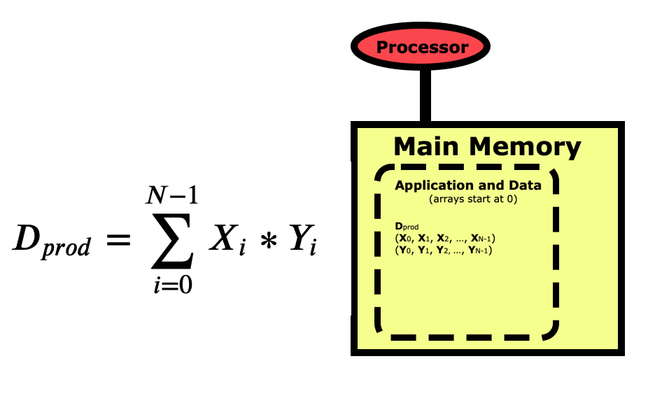

:::::::::::::::::::::::::::::::::::::: questions
- What does performance mean in programming?
- How do I take advantage of optimized libraries?
::::::::::::::::::::::::::::::::::::::::::::::::

::::::::::::::::::::::::::::::::::::: objectives
- Understand that what actually goes on in the computer may be much more
complex than what the user tells it to do.
- Have a basic understanding of some of the performance issues to be aware of.
- Learn that you don't have to be an expert programmer to take advantage of 
advanced performance techniques, you just need to be aware of how to use libraries
optimized by experts.
::::::::::::::::::::::::::::::::::::::::::::::::


## Conceptual View

When we write a program for a computer, we view the operation from
a more conceptual level.
The picture below is for a simple dot product between two vectors
X and Y, where the dot product D is the sum of the elements of each
vector multiplied together.
Notice first that the indexing for arrays in Python starts at 0 and
goes to N-1.  This varies between languages, wich C/C++ also starting
at 0, while R, Matlab, and Fortran start arrays at 1 and go to N.

When we think of a computer running a program to do this calculation,
we view it as starting with the variable D being pulled from main memory 
into the processor where this sum is zeroed out.
We then start
by pulling X0 up into the processor, then Y0, multiplying them together and
summing them into D.
We loop through all elements of the vectors, each time pulling the X and
Y element into memory, multiplying them together and summing them into D.
Then at the end, we push D back down into main memory where the program
prints the result out to the screen for us.

:::::::::::::::: group-tab

### Python

{ alt="Dot product formula" }

### R

Need fig/dot_prod_fig-1-N.jpg

### C

{ alt="Dot product formula" }

### Fortran

Need fig/dot_prod_fig-1-N.jpg

### Matlab

Need fig/dot_prod_fig-1-N.jpg

::::::::::::::::::::::::::

This conceptual view of what the computer is doing is all we really
need to be aware of when we are starting to writing programs.
But when those programs start taking too long to run on a PC or laptop,
then we need to understand what the computer is doing in more depth
so we can make sure that the code is running optimally.
Computers are internally quite complex, so fully understanding how code can be
written in different ways to streamline the processing can be very 
challenging.
Fortunately, not everyone needs to be able to write optimal low level
code.  For most of us, we just need to understand what programming
techniques in each language may cause performance problems, and 
understand how to take advantage of optimization libraries that 
experts have written for us.

## The Computer's View

Let's walk through the same dot product example again, but this time
looking at it from the point of view of the computer rather than our
conceptual view.
The first thing to understand is that when you pull a variable up from
main memory into the registers in a processor, what goes on behind the
scene is very complicated, but fortunately for us also totally automated.
Variables don't getted pulled up individually but as part of a 64-byte 
cache line. The variables in this cache line get promoted through several
layers of increasingly fast memory known as cache layers, with a copy
of the entire cache line being left behind in each layer.
In this way, the most frequentyly used data will be more likely to
be in one of the cache layers where it can be accessed more quickly.
In the case of our dot product, that means loading the first element
X1 may take 93-106 ns while the next 7 only take 3 ns since they are
already in L1 cache.

{ alt="Diagram of the memory hierarchy in a typical computer" }

How does this knowledge help us?
Performance is more about getting data to the processor since most
operations are very fast once the data is in the registers.
If the vector is instead not stored in contiguous memory, with each
variable in the next memory location, then the subsequent 7 memory
loads X2-X8 and Y2-Y8 will take 100 ns instead of 3 ns each.
This means that we need to ensure that variables we are using are in
contiguous memory whenever possible.
There will be an exercise at the end of this section where you will
measure the difference in execution time between these two cases.


Now let's look at a simple matrix multiplication algorithm which
is fairly simple to program, but may have very different performance
depending on how you write the code.

:::::::::::::::: group-tab

### Python

{ alt="Formula and diagram of a matrix multiply" }

### R

Need fig/matmult_fig-1-N.jpg.

### C

{ alt="Formula and diagram of a matrix multiply" }

### Fortran

Need fig/matmult_fig-1-N.jpg.

### Matlab

Need fig/matmult_fig-1-N.jpg.

::::::::::::::::::::::::::

Once the matrices are initialized, the code to multiply them together
is fairly simple.

:::::::::::::::: group-tab

### Python

```python
N = 100
for i in range( N ):
    for j in range( N ):
        C[i][j] = 0
        for i in range( N ):
            C[i][j] += A[i][k] * B[k][j]

```

### R

Not implemented yet.

### C

Not implemented yet.

### Fortran

Not implemented yet.

### Matlab

Not implemented yet.

::::::::::::::::::::::::::

But if we are concerned about performance, we need to take a better
look at this code.
Python is a row-major language like C/C++, which means matrices like
this are stored by rows first as in the picture above.
If we look at this code from a cache-line point of view, then
it looks optimal for the B matrix since when we load an element the
others in the cache line will get used in the next loop iterations,
but the A matrix is the opposite where elements being used next
are farther appart.

But it turns out this isn't really the way to look at performance in
this case.
For each element of C that we calculate, we will need N elements of A
and N elements of B.
So every element of A and every element of B will get re-used N times
during this calculation.
What is important is that when we pull each element into the L1 cache
where it is the fastest to access, we want to re-use it as much as possible
rather than having to pull it repeatedly from the lower caches or main memory.

An optimal approach has been developed in the past that pulls blocks of
each matrix into L1 cache.
This block optimization results in a much more complicated code,
but also a much higher performing one.
The good news is that for users like us, we don't have to ever program
it ourselves, we just need to know that it is in optimized libraries that
we can call at any time.
In the case of Python, there is an optimized matrix multiplaction function
in the **NumPy** library that is easy to use as shown below.

:::::::::::::::: group-tab

### Python

```python
import numpy as np

N = 100
C = np.matmult( A, B )
```

### R

Not implemented yet.

### C

Not implemented yet.

### Fortran

Not implemented yet.

### Matlab

Not implemented yet.

::::::::::::::::::::::::::

So while writing a matrix multiplication code from scratch is not
difficult, using the optimized function from **NumPy** is even 
easier and guarantees the best performance.
To find out how much difference there is in performance, you will need to
try for yourself by measuring the execution time for a few different
matrix sizes in the exercise below.


**NOTES**

memory access patterns - row major vs column major for matrices

  For large matrices, you may be pulling elements from main memory each time
  which is very slow.
  Show algorithm to illustrate complexity.

Good news is that in HPC, often the hard work is already done for you,
     you just need to know to make use of someone elses hard work.
  --> Use optimized libraries when at all possible.


:::::::::::::::: group-tab

### Python

:::::::::::::::::::::::::::::::::::::: challenge

**Measuring Cache Line Effects**

Run the dot_product.py code several times to get an average 
execution time for a dot product between two vectors of 
1 million elements each.  Try to run them on an isolated system
if possible, or through a batch queue that at least ensures the
code is being run on an isolated processing core.
Then run the dot_product_sparse.py code in the same manner for
comparison.
How much faster is the first code where the vectors are stored
in contiguous memory?
How much faster should it be?

:::::::::::::::::: solution

Is the time difference what we expected?
When I ran this on a new Intel processor that did not have 
any other jobs running, I measured 180 milliseconds for the
contiguous memory case and 1230 milliseconds for the sparse
case, resulting in a 6.9-times speedup by keeping the vector
in contiguous memory.
Since a cache line is 64 Bytes and each element is 8 bytes,
when the first element is loaded the next 7 are brought into
L1 cache essentially for free since they are in contiguous memory.
Therefore we expect it to take 100 ns to load 8 elements of X,
then 100 ns to load 8 elements of Y, then only a few ns to get
each element into the registers and do the computations.
For the sparse vectors, it should take 8 times as long since
each load will take 100 ns.
If you didn't see an 8-times speedup, don't worry.
The cache system is actually even more complicated than this picture.
Also remember that you may be sharing parts of the processor
with others.
The main thing to learn here is that if you take advantage of 
the cache line by keeping the vectors in contiguous memory, your
code will run faster.

:::::::::::::::::::::::::::
::::::::::::::::::::::::::::::::::::::::::::::::


:::::::::::::::::::::::::::::::::::::: challenge

**Time Different Matrix Multiplication Methods**

There are 2 separate codes supplied to perform the same matrix multiplication
for a given matrix size, matmult.py is raw Python code and matmult_numpy.py
uses the highly optimized **np.matmult()** function.
Both programs take the matrix size as an argument, so you run using
**python matmult.py 100** for example to measure the performance
for multiplying two 100x100 matrices.
Measure the performance for each method on 
a small 10x10 matrix, an intermediate sized 100x100 matrix, and
a large 1000x1000 matrix to see how each is 
affected by the optimized **numpy** function.
You should run this through a batch scheduler if at all possible
since numpy will grab any cores it can, and for a fair comparison
we want to test out only the single-core performance.

:::::::::::::::::: solution

For the 10x10 matrix size there are 3 matrices having 100 elements each
needing 8 bytes storage, so storing all 3 matrices requires only 2.4 kB
of memory.  Everything fits entirely in L1 cache, so the block optimized
algorithm from **NumPy** isn't really needed.
For the 100x100 matrix size, 240 kB is needed to store all 3 matrices so
they will fit entirely in L2 cache, but not L1 cache.
We therefore expect a significant improvement by using the 
optimized **np.matmult()** function.
For the 1000x1000 matrix size, we need 24 MB to store all 3 matrices so
it will reside in L3 cache.  The **np.matmult()** function should 
speed up this run by substantially more.
The optimization of the **NumPy** routine however goes far beyond just
block optimizing the algorithm so that it reuses data in L1 cache though.
There are also computational optimizations that allow for many 
multiply-add operations to occur in the same clock cycle, which is called
vectorization.
My measurements on a modern Intel processor more of a performance
benefit for larger matrix sizes.
For 1000x1000 matrices, the raw Python code was very slow at
6.5 MFlops (Million floating-point operations per second).
All the optimizations in the **NumPy** code brought the performance
up to 15.4 GFlops, or a whopping 2354 times faster.
Raw Python code is fairly slow in itself because it is interpretted
and not compiled like C/C++/Fortran code, clearly you can do very
well if you learn to use the heavily optimized library routines.
C is still faster than Python, with raw C code reaching 1.6 GFlops
and the optimized CBLAS DGEMM routine reaching 91 GFlops.

:::::::::::::::::::::::::::
::::::::::::::::::::::::::::::::::::::::::::::::


:::::::::::::::::::::::::::::::::::::: challenge

**Advanced Exercise - Transpose B to cache-line optimize it**

As k is incremented in the innermost loop, elements of A are being
brought into cache efficiently since they are stored in contiguous
memory, as we learned from the dot product example.  Unfortunately,
elements of B are not since they will be sparse, separated by N-1
elements each time.
While we already know that we can simply use the numpy routine
**np.matmult()** to optimize the code, if this wasn't available
one thing we'd consider is to transpose the B matrix so that it is
stored in column-major format before doing the matrix multiplication.
If you're up for a challenge, try programming this up to see if it
improves the performance compared to the original Python code.

:::::::::::::::::: solution

There are a great many levels of optimization that can be done
to the matrix multiplication algorithm.
Transposing B should improve the performance some.
For a more complete overview of what is done in the
**np.matmult()** algorithm and others like it, follow
the link:
https://en.algorithmica.org/hpc/algorithms/matmul/

:::::::::::::::::::::::::::
::::::::::::::::::::::::::::::::::::::::::::::::

### R

Not implemented yet.

### C

Not implemented yet.

### Fortran

Not implemented yet.

### Matlab

Not implemented yet.

::::::::::::::::::::::::::


## Summary

When it starts taking longer to run a given program, we need to
start looking beyond just whether it gives the correct answer
and begin considering performance.
This means we need to go beyond the conceptual view of how the
program runs to look at how it makes use of the underlying hardware
architecture.
While this can get very complicated very quickly, most users just
need to be aware of where performance bottlenecks can occur in order
to avoid them.
Quite often, writing optimal code just means taking advantage of 
highly optimized libraries that experts have written and tuned.
So most of us just need to know when and where to look for these
optimized routines in order to write highly optimized code.

::::::::::::::::::::::::::::::::::::: keypoints
- A computer's view of code is more complex than a user's view.
- It's important to understand a little about what goes on when code 
actually runs, but you don't need to be able to program at that level.
- Whenever possible, use code written and optimized by experts instead of
writing your own version.
::::::::::::::::::::::::::::::::::::::::::::::::

